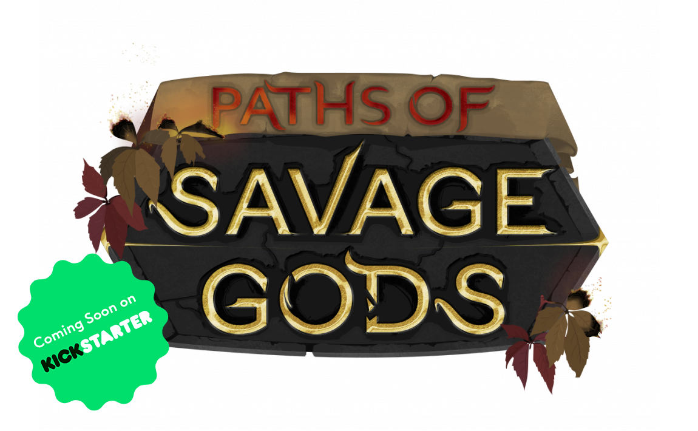

<link rel="stylesheet" href="style.css">

<!--start interaction section-->
<input type="text" id="input-query" name="query">
<button type="button" id="btn-reset">Reset!</button>
<!--end interaction section-->

When do you release Paths of Savage Gods (PoSG)?
  We plan to start our Kickstarter Campaign of PoSG in February 2021. So keep tuned! We hope that we can release PoSG in June or July 2021.

  <!-- QUESTION 00 -->
  

    
What exactly is PoSG?

    
PoSG is a tool for pen and paper RPGS that can procedurally generate and manage DnD5e adventures. It will provide the generation of maps, NPCs, encounters, and quests. PoSG is based on DnD5e SRD under OGL.

  

  <!-- END 00 -->
  
  <!-- QUESTION 01 -->
  

    
When do you release Paths of Savage Gods?

    
We plan to start our Kickstarter campaign of PoSG in February 2021. So keep tuned! We hope that we can release PoSG in June or July 2021.

  

  <!-- END 01 -->
  
  <!-- QUESTION 02 -->
  

    
On which platforms can I use PoSG? 

    
We plan to release the first version as a desktop app on Windows/macOS/Linux (official support only for the latest Ubuntu LTS) and a mobile version for iOS/iPadOS and Android (only smartphones, no tablets).

  

  <!-- END 02 -->

<!--start script section-->

<!--end script section-->
